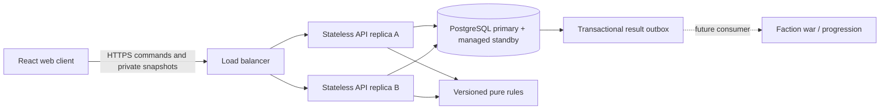

# Architecture decision record · 2026-10-02

## Decision

Use a TypeScript modular application: React/Vite for the web client, a Fastify API, a pure versioned rules package, and PostgreSQL as the authority for live matches. Match commands are short transactions. Any healthy API replica can process the next command or serve a reconnect. This fits simultaneous planning with 30-second turns and removes process affinity from the reliability model.

The implementation is intentionally small enough to own. Hosting portability comes from a standard Node 24 container and SQL, not from wrapping every dependency behind an interface. Current dependencies are pinned in the lockfile. No Kubernetes, Redis, message broker, or AI service is required for this slice.

## Boundaries

The diagram describes the deployment target. This change supplies the application/container and database schema, not provisioned redundant infrastructure. The outbox is written now; its progression consumer is a later milestone.

## Framework and service choices

| Area                       | Choice                                                    | Why / revisit trigger                                                                                                                                                                                                                                                    |
| -------------------------- | --------------------------------------------------------- | ------------------------------------------------------------------------------------------------------------------------------------------------------------------------------------------------------------------------------------------------------------------------ |
| Client                     | React + Vite + semantic HTML/CSS                          | Cards, selections, tutorials, and menus benefit from browser accessibility. Add a Pixi/Phaser scene for animation only if profiling and art direction justify it. No SSR requirement for a private battle screen.                                                        |
| Rules                      | Pure TypeScript, explicit team IDs                        | Same types across systems; deterministic replay and fast rules tests. Supports two/four seats in the engine; shipped API/UI remains 1v1.                                                                                                                                 |
| API                        | Fastify + Zod                                             | Small HTTP surface, strict input validation, request IDs, structured logs. Browser does not supply actor identity.                                                                                                                                                       |
| Match persistence          | PostgreSQL row transactions                               | State, private journal, retry receipt, and result commit atomically. Contention is per match.                                                                                                                                                                            |
| Transport                  | HTTPS commands + 1s private snapshot polling              | Straightforward recovery semantics for low-frequency turns. This is a private-alpha transport, not a claimed large-CCU solution. Add SSE invalidations with revision-based refetch before public scale.                                                                  |
| Identity, now              | Invite-gated opaque sessions                              | Private playtests only. Hashed tokens, HttpOnly/SameSite cookies, origin checks. No durable account recovery.                                                                                                                                                            |
| Identity, production       | Managed OIDC provider, selected before public alpha       | Avoid maintaining passwords/recovery/email delivery. Keep internal player IDs independent of provider subject. Evaluate Cognito and a managed specialist using mobile flows, moderation, deletion, migration, and cost at forecast MAU. Not yet integrated or purchased. |
| Hosting, private alpha     | Portable container + separate managed Postgres            | Existing Fly familiarity makes it a reasonable staging candidate; use a new app/database. Provision only after cost review.                                                                                                                                              |
| Hosting, production target | ECS Fargate across ≥2 AZs + ALB + RDS PostgreSQL Multi-AZ | Explicit failure-domain isolation and managed database failover. This is the recommended target, contingent on budget and operational capacity. No AWS resources are created here.                                                                                       |
| Static assets              | Same container now; object storage/CDN later              | One artifact simplifies first staging rollout. Immutable content-hashed assets should move to CDN ahead of public traffic.                                                                                                                                               |
| Observability              | Structured request/error logs + liveness/readiness now    | Add OpenTelemetry traces, dashboards, alerts, and error tracking before external alpha.                                                                                                                                                                                  |
| Faction/progression        | PostgreSQL result outbox, asynchronous consumer later     | Match completion must not depend on a war-map update or reward service being healthy.                                                                                                                                                                                    |
| Native mobile              | Evaluate Capacitor after responsive web retention         | Do not promise native performance before device profiling; API/rules remain independent of renderer.                                                                                                                                                                     |

Colyseus remains a good candidate if Coba changes into a continuous real-time game. Its documentation states that a room belongs to one process; scaling discovery does not by itself provide durable failover. For this game's low command rate, durable HTTP commands are a simpler fit. This is a design inference from the [Colyseus scaling model](https://docs.colyseus.io/scalability), not a claim that Colyseus cannot be made durable.

Fly currently advertises managed HA and recovery features; validate its exact failure domains and restore behavior in a staging drill before treating it as sufficient for a production SLO. See [Fly Managed Postgres](https://fly.io/mpg/). AWS documents [ECS availability-zone balancing](https://docs.aws.amazon.com/AmazonECS/latest/developerguide/service-rebalancing.html) and [RDS standby configurations](https://docs.aws.amazon.com/AmazonRDS/latest/UserGuide/). None of these service features establish end-to-end availability without deployment and testing.

## Command and recovery contract

1. Browser sends `{ commandId, turn, action }` using its session cookie. Input rejects unknown keys, cards, zones, invalid IDs, and oversized bodies.
2. API authenticates session and locks the match row with `SELECT ... FOR UPDATE`. Ownership is checked before returning anything.
3. An existing receipt with the same ID and body returns the current authorized snapshot. Reusing an ID with a different body returns 409. A duplicate can legitimately return a newer snapshot than the original response.
4. Database time determines whether the persisted deadline elapsed. A late command is rejected, but the elapsed turn still commits.
5. Validate card ownership, energy, cooldown, turn, and lock state. Commit accepted state, journal entry, receipt, and any terminal result together.
6. Respond only after commit. If the response is lost, retry the same ID. If a process crashes before commit, the transaction rolls back. If it crashes after commit, another replica serves the saved result.

PostgreSQL's documented [row locking](https://www.postgresql.org/docs/current/explicit-locking.html) underpins per-match serialization. Command receipts are at-most-once logical application, not magical exactly-once delivery across networks.

Every API replica runs a bounded deadline sweep. `FOR UPDATE SKIP LOCKED` lets workers share due matches safely. No process-local timer owns a turn. After a full outage, only one elapsed turn resolves on recovery and players receive a full new planning window, avoiding a cascade of instant forfeits. A worker failure delays timeouts; it does not delete matches. GET requests are read-only; late writes also enforce deadlines.

The engine snapshots its PRNG state and deck order. It aggregates additions/removal before scoring both teams. Journals record the initial game and accepted inputs; keep them private because they contain hidden information. The player serializer includes only board, scores, public history, readiness, and the requesting player's hand. It never emits RNG, draw order, pending actions, or opponents' hands.

## Deployment/versioning invariants

- One writable home region for the initial population. Do not route the same match to independent writable databases. Regional disaster recovery is explicit failover, not active-active.
- Multiple replicas share the same database and ruleset implementation. Database primary/failover is a shared dependency.
- Released content versions are immutable. Before introducing `frontier-2`, add a ruleset dispatcher and retain `frontier-1` for active games and replays. Current runtime supports `frontier-1` only.
- Migrations run as a separate serialized release job, with expand/contract changes. App containers do not migrate on startup. Rollback must retain readers for newly persisted schemas.
- Command receipts and result dedupe keys must outlive their retry/reward windows. Define archive/retention jobs before traffic; do not silently delete active session foreign keys.
- Faction consumer must insert a unique `(match_id, reward_kind)` ledger entry in the same transaction as its effect, then mark the outbox item processed. Delivery retries must never duplicate currency or war influence.

## Capacity and reliability targets

Initial load-test envelope: 1,000 concurrent players, 500 matches, 30-second turns. Planning commands average roughly 33/s when everyone commits once per turn; bursts may be much higher. Current polling adds roughly 1,000 snapshot requests/s plus session lookups, so measure DB CPU, I/O, connection wait, serialization, and payload size before claiming this capacity. The full journal stays private; only bounded (≤16-turn) public history is sent.

Before public alpha, add ETags/revision checks and SSE invalidation fanout, database connection budgeting, shared edge throttling, hard lobby/session quotas, region-aware matchmaking, load shedding, and scheduled retention. Redis may serve ephemeral delivery/rate limiting if justified; it must not become the only match store.

Proposed public-beta SLOs: 99.9% successful valid commands, p95 command acknowledgment <300ms in-region, p99 <1s, deadline processing lag <2s under normal operation. Deployment recovery target <30s. Acknowledged-command loss target is zero for application process failures; database/regional loss guarantees depend on replication and restore configuration. These are goals, not measured results.

## AI model strategy

Interpret the rebuild request as AI-assisted development unless the game direction explicitly calls for AI gameplay. Use current coding models for implementation, test generation, balance analysis, and content exploration. Keep code review, repeatable tests, deterministic replays, and human playtests as release gates. No model provider belongs in the turn-resolution path.

The [official OpenAI model catalog](https://developers.openai.com/api/docs/models/all) is the discovery source for future selection; model names and account availability change. Do not bind game architecture or persisted game data to a specific newest model. For a future coaching/content feature, select a model with an evaluation set, pin a supported version, enforce structured outputs and spending/latency limits, and supply only the information that player is entitled to see. Runtime AI would be a separate proposal, configuration, and evaluation pipeline. This foundation has no model API dependency or API key requirement.
